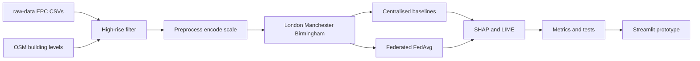

# Chapter 3 — Methodology

## 3.1 Research design overview

The study follows a comparative experimental design. A single filtered EPC corpus is (a) trained centrally with multiple regressors and (b) trained federatively with an MLP under FedAvg across three geographic clients. Predictive metrics and SHAP-based explanation stability are compared on a held-out test set. A Streamlit prototype demonstrates stakeholder-facing use. The design privileges reproducibility: all scripts live under `scripts/`, core libraries under `src/`, and artefacts under `results/`.

Hypotheses:

- **H1:** Federated Averaging achieves test RMSE within 5% of the centralised MLP on the same held-out set.
- **H2:** Spearman rank correlation of mean |SHAP| profiles between centralised and federated models exceeds 0.85.
- **H3:** Top-5 influential building features are consistent across at least 80% of federated clients (pairwise Jaccard of per-client top-5 sets; pass if average Jaccard > 0.60).
- **H4:** The Streamlit prototype can present SHAP/LIME outputs with an EU AI Act Article 13 transparency note.



## 3.2 Data sources and licence

Primary data are UK EPC bulk certificate CSVs for domestic and non-domestic buildings (Open Government Licence v3.0), stored locally under `raw-data/domestic-csv/` and `raw-data/non-domestic-csv/`. Years 2018–2026 were scanned in chunked mode to limit memory use (domestic national files exceed tens of gigabytes). Recommendations CSVs were not used. Supplementary OSM GeoJSON files (`building:levels >= 10`) for London, Manchester, and Birmingham were downloaded via Overpass API mirrors and saved to `data/raw/osm/`.

Attribution for dissertation submission should cite the Ministry of Housing, Communities and Local Government (or successor) EPC open data and OGL v3.0.

## 3.3 High-rise filtering and targets

Chunked loading is implemented in `src/data/data_loader.py` with constants in `src/data/column_definitions.py` matching **underscore** bulk headers.

| Typology | Inclusion rules | Target variable |
|----------|-----------------|-----------------|
| Domestic | `property_type == Flat`; `flat_storey_count >= 5`; local authority in client mapping | `energy_consumption_current` |
| Non-domestic | `floor_area >= 5000`; exclude education/health/worship/sports keywords; client LA | `primary_energy_value` |

Unified modelling column: `energy_consumption`. Extreme or non-positive targets were removed. Client assignment uses `local_authority_label` mapped to London / Manchester / Birmingham authority lists.

**Leakage control:** `co2_per_area` and `asset_or_env_score` were excluded from features after early experiments showed unrealistically high R² when included.

## 3.4 Preprocessing

`EPCPreprocessor` (`src/data/preprocessor.py`) applies:

1. Frame preparation and outlier clipping of the target at the 1st–99th percentiles.
2. Median imputation for numeric features (`floor_area`, `storey_count`).
3. Most-frequent imputation and one-hot encoding for categoricals (typology, property type, fuel, heating, efficiencies, glazing, aircon, city).
4. Standard scaling of numeric columns.
5. 80/20 train–test split (city-stratified when feasible).

The fitted `ColumnTransformer` is persisted to `data/processed/preprocessor.joblib`. Each client CSV is transformed with the same fitted pipeline for FL.

## 3.5 Centralised models

Models in `src/models/centralised_models.py`:

- Random Forest (200 trees)
- Gradient Boosting (sklearn)
- XGBoost
- LightGBM (`n_jobs=1` for macOS OpenMP stability)
- MLPRegressor (128–64 hidden units, early stopping)

Metrics: RMSE, MAE, R², MAPE. Best model by RMSE proceeds to primary SHAP comparison.

## 3.6 Federated learning protocol

An MLP (`EnergyMLP` in `src/federated/fl_client.py`) is trained with in-process FedAvg for eight rounds, four local epochs per round, Adam optimiser, MSE loss. Client updates are averaged with weights proportional to local sample sizes. This simulates regional data residency without exposing raw client matrices to other clients during training. A Flower `NumPyClient` wrapper and optional `fl_server.py` support future full-server deployments; the reported results use the reproducible simulator.

## 3.7 Explainability protocol

On a shared subsample (background ≈ 80 training rows; explain ≈ 60 test rows):

- SHAP KernelExplainer for best centralised model and federated MLP
- Mean |SHAP| ranking exported to CSV/PNG under `results/figures/`
- LIME tabular explanations for three instances per model
- Stability: Spearman correlation between centralised and federated mean |SHAP| vectors (H2)
- **H3:** per-client TreeExplainer SHAP on the centralised Gradient Boosting model applied separately to each city matrix; pairwise Jaccard similarity of top-5 feature sets (`scripts/run_h3_per_client_shap.py`)

## 3.8 Statistical tests

Paired Wilcoxon signed-rank and paired t-tests compare absolute errors of the best centralised model versus federated MLP predictions on the identical test set (`src/evaluation/metrics.py`). Cohen’s d on absolute errors and bootstrap percentile 95% confidence intervals for RMSE (2,000 resamples) are also reported (`scripts/run_bootstrap_ci.py`).

## 3.9 Prototype

`src/webapp/app.py` loads the preprocessor and best centralised model, accepts building inputs, returns a predicted energy intensity, and displays global SHAP importance. Launch:

```bash
arch -arm64 /bin/zsh -c 'source scripts/env.sh && streamlit run src/webapp/app.py'
```

## 3.10 Ethical considerations

Only open EPC certificate fields and OSM building tags were used. No attempts were made to re-identify individuals beyond data already published. Synthetic data generators exist solely for pipeline testing when raw files are absent and are flagged when used.


## 3.11 Implementation environment

Development used Python 3.13 on macOS (Apple Silicon), with a project virtualenv documented in `requirements.txt`. Key libraries: pandas, scikit-learn, XGBoost, LightGBM, PyTorch, Flower, SHAP, LIME, Streamlit, SciPy. Apple Silicon required bundling `libomp` beside XGBoost/LightGBM dylibs and avoiding `DYLD_LIBRARY_PATH` overrides that break NumPy. Launch scripts prefer `arch -arm64 /bin/zsh` when Terminal/Conda may run under Rosetta.

## 3.12 Reproducibility checklist

1. Place certificate CSVs under `raw-data/domestic-csv` and `raw-data/non-domestic-csv`.
2. `source scripts/env.sh`
3. `/bin/bash scripts/run_all.sh` (or arm64 zsh wrapper per `dev-docs/MANUAL_DATA_NOTES.md`)
4. Confirm `results/tables/model_comparison.csv` and `xai_stability.json`
5. `streamlit run src/webapp/app.py`

## 3.13 Metrics definitions

For true values \(y_i\) and predictions \(\hat{y}_i\):

- RMSE = \(\sqrt{\frac{1}{n}\sum (y_i-\hat{y}_i)^2}\)
- MAE = \(\frac{1}{n}\sum |y_i-\hat{y}_i|\)
- R² = coefficient of determination
- MAPE = \(\frac{100}{n}\sum |y_i-\hat{y}_i|/\max(|y_i|,\epsilon)\)

MAPE is sensitive to small targets; it is reported for completeness alongside RMSE/MAE/R².


## 3.14 Summary

Chapter 3 defined data filters, leakage controls, models, FedAvg settings, XAI protocol, and tests. Chapter 4 reports the outcomes of executing that protocol on the local EPC corpus.
